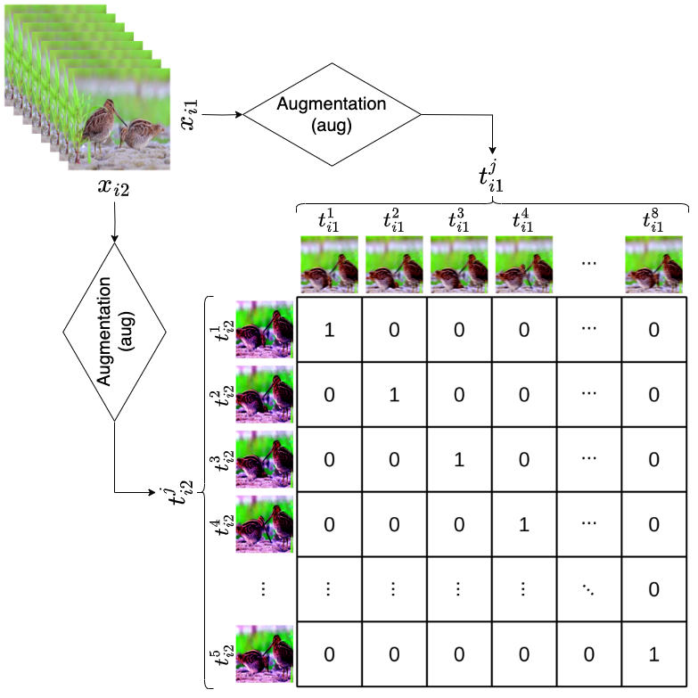

# Introduction


This repo is used to do the AFRICAN pretraining. For whole architecture, please refer to [AFRICAN](https://github.com/GoatWang/AFRICAN).

# Train
```
python3 Train/train.py with '<parameters>'
```

